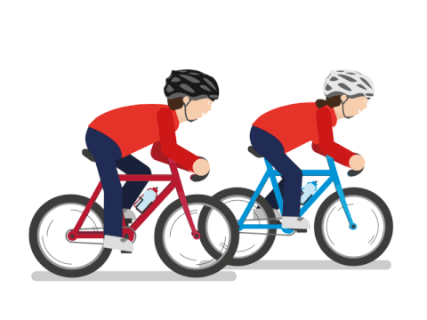

<h1 align="center"> Bike Sharing Demand Prediction</h1>
<h5 align="center"> AlmaBetter Verfied Project - <a href="https://www.almabetter.com/"> AlmaBetter School </a> </h5>

 

## Index

| Sl. No. | Section         |  
|:--------|:-------------------------|
|    1    |   <a href="https://github.com/shaloy-lewis/bike_sharing_demand_prediction#1-introduction">   Introduction  </a>    | 
|    2    |   <a href="https://github.com/shaloy-lewis/bike_sharing_demand_prediction#2-eda-summary">   EDA Summary    </a>   | 
|    3    | <a href="https://github.com/shaloy-lewis/bike_sharing_demand_prediction#3-modelling-summary"> Modelling Summary  </a> | 
|    4    | <a href="https://github.com/shaloy-lewis/bike_sharing_demand_prediction#4-results">        Results     </a>     |
| 5 | <a href="https://github.com/shaloy-lewis/bike_sharing_demand_prediction#5-conclusions"> Conclusions  </a> |

## 1. Introduction
* Currently Rental bikes are introduced in many urban cities for the enhancement of mobility comfort. It is important to make the rental bike available and accessible to the public at the right time as it lessens the waiting time. Eventually, providing the city with a stable supply of rental bikes becomes a major concern. The crucial part is the prediction of bike count required at each hour for the stable supply of rental bikes.
* The goal of this project is to build a ML model that is able to predict the demand of rental bikes in the city of Seoul. We are provided with the data of weather conditions, office holidays, and the number of bikes rented each hour for 12 months.

## 2. EDA Summary

* The dependent variable is positively skewed.
* Normally distributed attributes: temperature, humidity.
* Positively skewed attributes: wind, solar_radiation, snowfall, rainfall.
* Negatively skewed attributes: visibility.
* Positively correlated variables: temperature, windspeed, visibility, solar radiation.
* Negatively correlated variables: humidity, rainfall, snowfall.
* The number of bikes rented is on average higher during the rush hours.
* The rented bike counts is higher during the summer and lowest during the winter.
* The rented bike count is higher on working days than on non-working days.
* On a non-functioning day, no bikes are rented in all the instances of the data.
* The number of bikes rented on average remains constant throughout Monday - Saturday, it dips on Sunday, and on average, the rented bike counts is lower on weekends than on weekdays.
* There is no multicollinearity in the data.
* Temperature has the highest correlation with the dependent variable
* There are outliers in the data and this must be taken into consideration in the model building phase.
* In winters the overall demand for rented bikes is comparatively lower than that of other seasons.
* On a non-functioning day, no bikes are rented.
* The demand for rented bikes throughout the day on holidays and weekends follow a different pattern than other days.
* On regular days, the demand for the bikes is higher during rush hours. On holidays or weekends, the demand is comparatively lower in the mornings, and is higher in the afternoons

## 3. Modelling Summary
* Choice of split: K-fold cross validation, where K = 6
  This choice of split was chosen because we had the computational power available to use this split, and thereby reducing overfitting
* Evaluation metrics: RMSE – Root Mean Square Error
  During the EDA phase, we find that the data we are dealing with contains a lot of outliers. Hence to punish the outliers, we choose this metric.
* Hyperparameter tuning: GridsearchCV
  Grid Search combines a selection of hyperparameters established by the scientist and runs through all of them to evaluate the model’s performance. Through this     method, we can establish the set of parameters such that they do not overfit the data.

### 3.1. Decision tree
* This can be considered as the baseline model to obtain predictions. Decision trees are easy to explain, and tend to have low bias and high variance (Overfitting).
* Best hyperparameters: max_depth = 20, min_samples_leaf = 30
* Decision Tree train RMSE: 263.27 
* Decision Tree test RMSE:  294.39
* Decision Tree train R2 score: 83.30 %
* Decision Tree test R2 score: 79.29 %

### 3.2. Random forests
* Random Forest is an ensemble technique which use multiple decision trees and a technique called Bootstrap and Aggregation, commonly known as bagging. The basic idea behind this is to combine multiple decision trees in determining the final output rather than relying on individual decision trees.
* Best hyperparameters: min_samples_leaf = 25, n_estimators = 500
* Random Forests train RMSE: 171.52
* Random Forests test RMSE: 204.50
* Random Forests train R2 score: 84.32 %
* Random Forests test R2 score: 81.36 %

### 3.3. Gradient Boosting Method (GBM)
* In gradient boosting, each predictor corrects its predecessor’s error. Each predictor is trained using the residual errors of predecessor as labels.
* Best hyperparameters: min_samples_leaf = 26, n_estimators = 500
* GBM train RMSE: 160.93
* GBM test RMSE: 189.36
* GBM train R2 score: 92.91 % 
* GBM test R2 score: 90.00 %

### 3.4. Extreme Gradient Boosting (XG Boost)
* In XG Boost, decision trees are created in sequential form. Weights are assigned to all the independent variables which are then fed into the decision tree which predicts results. The weight of variables predicted wrong by the tree is increased and the variables are then fed to the second decision tree. These individual classifiers/predictors then ensemble to give a strong and more precise model.
* Best hyperparameters: min_samples_leaf = 25, n_estimators = 500
* XG Boost train RMSE: 167.93
* XG Boost test RMSE: 199.72
* XG Boost train R2 score: 93.20 %
* XG Boost test R2 score: 90.46 %

## 4. Results

| Sl. No. |     Regression Model     |     Train RMSE     |     Test RMSE      | Train R2 Score (%) | Test R2 Score (%) |
|:--------|:-------------------------|:-------------------|:-------------------|:-------------------|:------------------|
|    1    |      Decision Tree       | 263.27 | 294.39 | 83.30  | 79.29 |
|    2    |      Random Forests      | 255.13 | 279.28 | 84.32  |  81.36 |
|    3    | Gradient Boosting Method | 171.52 | 204.50 | 92.91  | 90.00 |
|    4    |         XG Boost         | 167.93 | 199.72 | 93.20  |  90.46 |

## 5. Conclusions
It was found that the XG Boost model had the lowest test RMSE and the highest R2 score.

The final choice of model for deployment depends on:
* If it is absolutely necessary to have a model with the best accuracy, then XG boost will be the best choice, since it has the lowest RMSE and highest R2 score than other models built.
* But we know that, higher the model complexity, lower is the model interpretability. Hence if the predictions must be explained to stakeholders, then XG Boost is not an ideal choice.
* In this case decision tree can be used, since they are easier to explain. By choosing a simpler model, we will be compromising with the model accuracy (Accuracy vs Interpretability trade-off).
